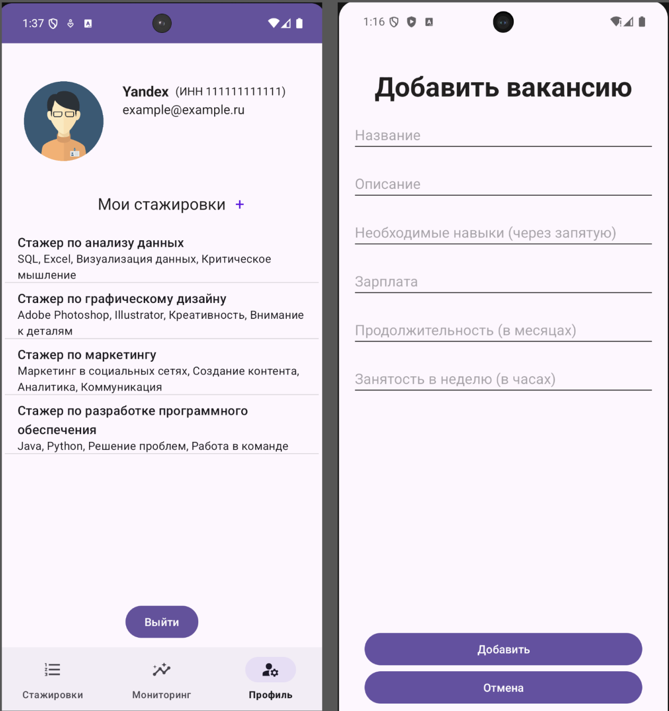

### Мобильное приложение для поиска и подбора стажировок и практики для студентов вузов

Сервис поможет студентам найти подходящие возможности для стажировки, а работодателям — найти квалифицированных кандидатов. Согласно исследованию, проведенному агентством SuperJob, 55% работодателей предпочитают нанимать выпускников, которые уже имеют опыт работы, полученный через стажировки. Это означает, что спрос на качественные стажировки и практики растет среди студентов, и они понимают их важность для дальнейшего трудоустройства

## Мобильное приложение 

Умный поиск вакансий и информаици о вакансии

Список откликов адаптируется под пользователя в зависимости от того студент он или компания. 

Профиль адаптируется под пользователя в зависимости от того студент он или компания. Студент может добавить список своих навыков и прикрепить ссылку на резюме. Компания может создать новую вакансию

Регистрация отличается неакоторыми полями для студента и компании, а страница входа является универсальной

## Бэкенд

База данных приложения

REST API

